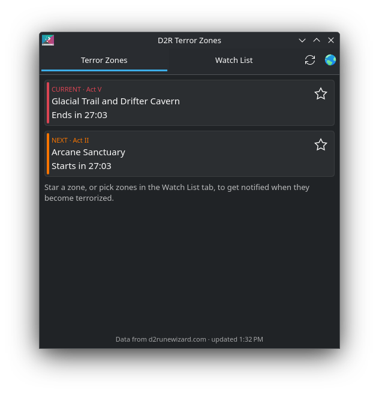

# D2R Terror Zones — KDE Plasma widget

A Plasma 6 widget that shows the current and upcoming **Diablo II: Resurrected terror zones**
(data from [d2runewizard.com](https://d2runewizard.com/terror-zone-tracker)), counts down to the
next rotation (every 30 minutes), and notifies you when zones you care about are about to become terrorized.



## Features

- Current and next terror zone, with act and a live countdown
- Panel icon with countdown; a green dot marks when a watched zone is active (filled) or next (ring)
- Watch list of all 36 terror zones grouped by act, or star the current/next zone directly
- Desktop notifications for watched zones:
  - when announced as the next zone
  - a configurable reminder N minutes before it starts
  - when it becomes terrorized
- Middle-click the panel icon to refresh

## Install

From the KDE Store: *Add Widgets… → Get New Widgets… → Download New Plasma Widgets* and search for
**D2R Terror Zones**.

Or from source:

```sh
git clone https://github.com/p145085/plasma-d2r-terrorzones.git
kpackagetool6 -t Plasma/Applet -i plasma-d2r-terrorzones/package
```

Upgrade with `kpackagetool6 -t Plasma/Applet -u plasma-d2r-terrorzones/package`.

## Build a .plasmoid

```sh
cd package && zip -r ../d2r-terrorzones.plasmoid . && cd ..
```

## Notes

Since patch 3.0 terror zones rotate every 30 minutes, on the hour and half hour. The d2runewizard
API only exposes the current and next zone, so notifications can't look further ahead than the next
rotation. At each rotation the widget advances immediately and polls until the API catches up.

Not affiliated with Blizzard Entertainment or d2runewizard.com.

## License

GPL-3.0-or-later
